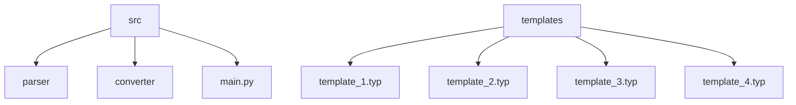

# Jupyter to Typst Converter
## 🗂️ Description

The Jupyter to Typst Converter is a Python-based tool designed to convert Jupyter notebooks (.ipynb) into Typst files, which can then be compiled into beautifully formatted PDFs. This project is ideal for users who want to transform their Jupyter notebooks into a more readable and professional document format. The converter supports various templates and color themes, allowing for customizable output.

The tool works by parsing the Jupyter notebook, extracting cell data, and then transforming this data into Typst source code using a specified template. The resulting Typst file can be compiled into a PDF, providing a polished document that is easy to read and understand.

## ✨ Key Features

* **Jupyter Notebook Parsing**: Extracts cell data, including source code, outputs, and images, from Jupyter notebooks (.ipynb).
* **Typst Conversion**: Transforms notebook cell data into Typst source format using customizable templates.
* **PDF Generation**: Compiles Typst files into beautifully formatted PDFs.
* **Template Support**: Offers multiple templates for styling and organizing Typst documents.
* **Color Themes**: Allows for customizable color themes in the generated Typst documents.

## 🗂️ Folder Structure



## 🛠️ Tech Stack


## ⚙️ Setup Instructions

To run the Jupyter to Typst Converter locally, follow these steps:

* Clone the repository: `git clone https://github.com/HimanshuSardana/jup2typ.git`
* Navigate to the project directory: `cd jup2typ`
* Install dependencies: `pip install -r requirements.txt`
* Run the converter: `python main.py --input <input.ipynb> --output <output.typ> --template <template.typ>`

## 📝 Usage

The converter can be used via the command-line interface. For example:

```bash
python main.py --input example.ipynb --output example.typ --template template_1.typ
```

This command converts `example.ipynb` to `example.typ` using `template_1.typ` and then compiles it to a PDF.

## 🤔 Known Issues

* Currently, the converter supports a limited set of templates and color themes. Contributions to add more templates and themes are welcome.

## 🤝 Future Development

Future updates will focus on enhancing the converter's functionality, including support for more advanced Jupyter notebook features and additional Typst templates.


<br><br>
<div align="center">

<h3>Himanshu Sardana</h3>
<p>Sub-optimal arch user</p>
</div>
<br>
<p align="right">
  <a href="https://gitfull.vercel.app">Made by GitFull</a>
</p>
    