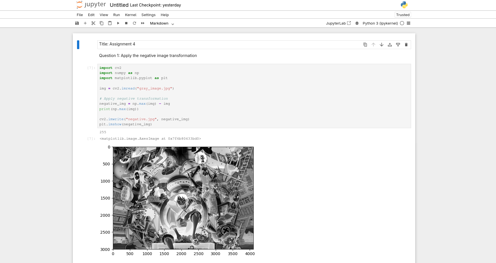
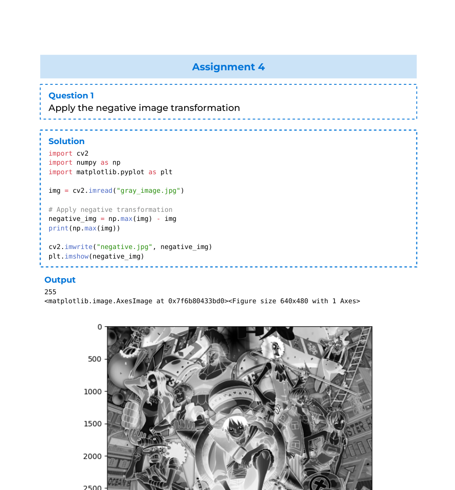
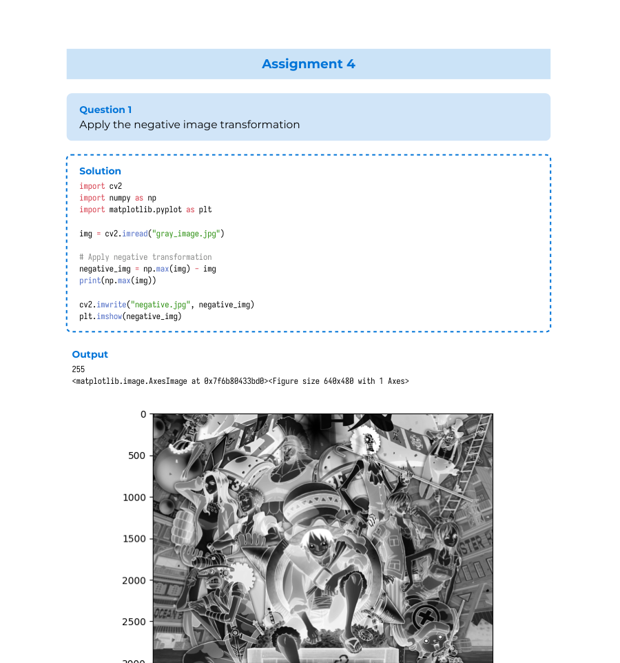
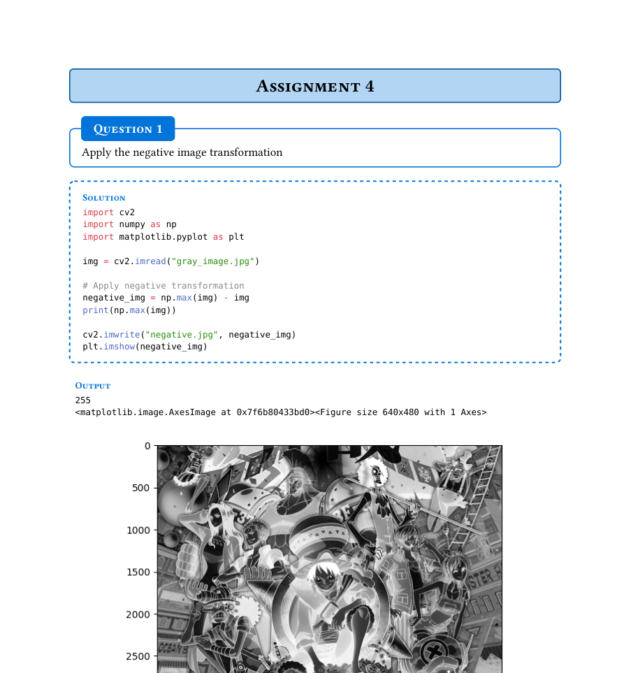
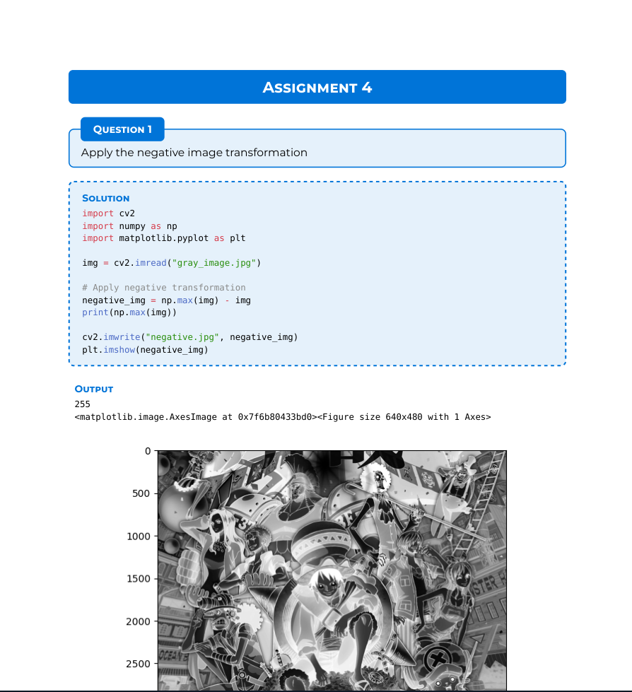

# jup2typ
A simple script I wrote to convert Jupyter Notebooks into Typst documents. (so i could stop having to manually copy paste code snippets and outputs)

## Themes
There are currently a total of 4 themes

The script turns a plain Jupyter Notebook  
 

into a Typst document with one of the following themes:

Theme 1

Theme 2

Theme 3

Theme 4

### TODOs
- [x] Add templates
- [ ] Add title page option
- [ ] Add interactive mode

